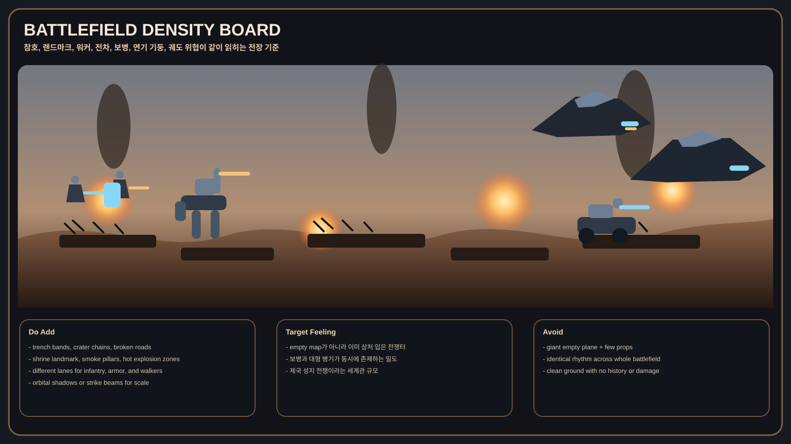
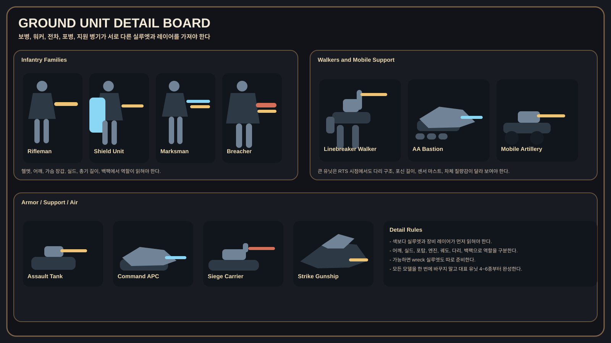
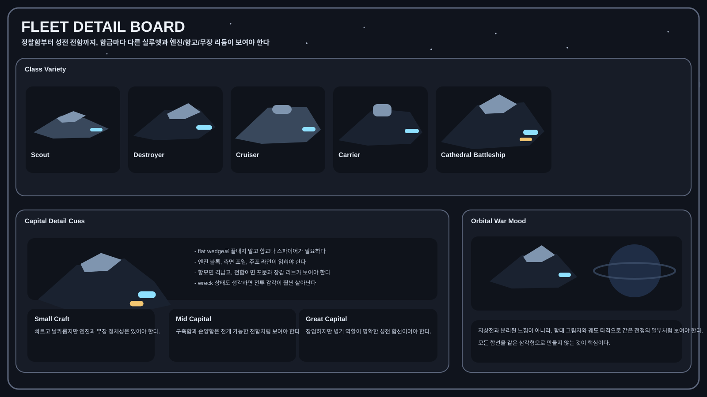

# ART_DIRECTION.md

## 아트 방향
- 이 프로젝트의 핵심 감각은 `장엄한 성전 + 거대한 제국 + 우주 배경의 SF 전쟁`이다.
- 순수 판타지도 아니고, 순수 군사 SF도 아니다. 둘이 섞인 `우주 성전 전쟁`처럼 보여야 한다.
- 전장은 빈 테스트맵이 아니라 실제로 전쟁이 진행 중인 장소처럼 보여야 한다.
- 유닛과 함선은 단순 프리미티브 덩어리가 아니라 역할이 읽히는 전쟁 병기처럼 보여야 한다.

## 빠른 참고 보드

- 위 이미지는 전체 방향을 빠르게 맞추는 요약 보드다.
- 예전처럼 한쪽 감각으로 몰리지 않도록 `전장`, `지상 병기`, `함선`을 따로 분리한 상세 보드를 아래에 추가했다.

## 상세 보드 1. 전장 밀도

- 전장은 참호, 방벽, 크레이터, 잔해, 화염, 연기 기둥, 랜드마크, 궤도 위협이 함께 보여야 한다.
- 목표는 `비어 있는 테스트 필드`가 아니라 `이미 수많은 전투가 벌어진 장소`다.

## 상세 보드 2. 지상 유닛 디테일

- 보병, 방패 보병, 정찰형, 브리처, 워커, 전차, 포병, 지원 차량이 서로 다른 실루엣을 가져야 한다.
- 헬멧, 어깨, 가슴 장갑, 무기, 백팩, 실드, 포탑, 궤도와 다리 구조에서 역할이 읽혀야 한다.

## 상세 보드 3. 함선 디테일

- 함선은 전부 비슷한 삼각형이 아니라 정찰함, 구축함, 순양함, 항모, 전함, 거대 성전 함선이 다른 리듬을 가져야 한다.
- 함교, 엔진 블록, 주포 라인, 격납고, 장갑 리브가 읽혀야 한다.

## 감정 톤
- 우주적
- 장엄함
- 위압감
- 숭고함
- 전쟁의 무게감
- 문명 규모의 성전

## 전장 기준
- 평평한 바닥 한 장으로 끝나면 안 된다.
- 참호선, 무너진 길, 크레이터, 제단, 폐허, 경계등, 잔해, 불길이 층층이 보여야 한다.
- 중앙 성지, 아군 전선, 적 전선이 서로 다른 장면으로 읽혀야 한다.
- 상공의 함선 그림자나 궤도 타격 흔적이 보이면 세계관 규모가 커진다.

## 유닛 기준
- 유닛 하나만 봐도 역할이 읽혀야 한다.
- 같은 진영 안에서도 보병, 워커, 차량, 비행기, 함선이 각기 다른 병기처럼 보여야 한다.
- 무기, 포신, 장갑, 엔진, 날개, 포탑, 격납고 같은 요소가 살아 있어야 한다.
- 가능하면 정상 상태와 파괴 상태, wreck 상태도 구분되면 좋다.

## 플레이어 진영 비주얼
- 중장갑 성전 제국 병사 느낌
- 종교적 권위와 군사성이 결합된 우주 제국 미학
- 둔중한 장갑, 무거운 실루엣, 의식적인 문양, 깃발과 성전 상징이 어울려야 한다.
- 금속, 백색, 청색, 금색 계열이 잘 어울린다.

## 적 진영 비주얼
- 정면 화력형 우주 전쟁 문명 느낌
- 플레이어보다 더 공격적이고 화력 집중형으로 보이면 좋다.
- 붉은색, 어두운 금속, 발광 사인과도 잘 어울린다.

## 애니메이션 방향
- `Idle`, `Move`, `Attack`, `Hit/Block`, `Death` 감각이 분명해야 한다.
- 플레이어 병사는 무겁고 단단하게, 적 병사는 공격적이고 전진적으로 보이면 좋다.

## 피해야 할 방향
- 로블록스/마인크래프트처럼 보이는 프리미티브 덩어리 느낌
- SF는 있는데 성전/제국 감정이 없는 방향
- 장식은 많은데 병기 역할이 안 읽히는 방향
- 모든 유닛을 한 번에 완성하려는 과한 확장

## 레퍼런스 이미지 사용 규칙
- 사용자 이미지에만 고정하지 않아도 된다.
- 필요하면 AI가 직접 레퍼런스를 더 찾아도 된다.
- 다만 무작정 많이 모으지 말고, 현재 작업에 실제로 도움이 되는 것만 골라야 한다.
- 시작점으로는 `Docs/Reference/VISUAL_REFERENCE_LINKS.md`와 위 로컬 보드 이미지를 먼저 참고한다.

## 우선순위
- 플레이어 기본 보병 1종과 적 기본 보병 1종부터 기준 비주얼을 만든다.
- 필요하면 기준 워커/전차 1종, 기준 함선 1종까지 추가해 대표 모델 묶음을 만든다.
- 맵 전체를 한 번에 바꾸기보다 `중앙 성지`, `아군 전선`, `적 전선` 같은 핵심 구역부터 강화한다.

## ?? ?? ???
- ? ?? ?? ?? ???? `Docs/Reference/LOCAL_VISUAL_GALLERY.md`? ????.
- ??, ??, ??, ??? ? ?? ?? ?? ? ???, ?? ??? ??? ??? ?? ? ??.
